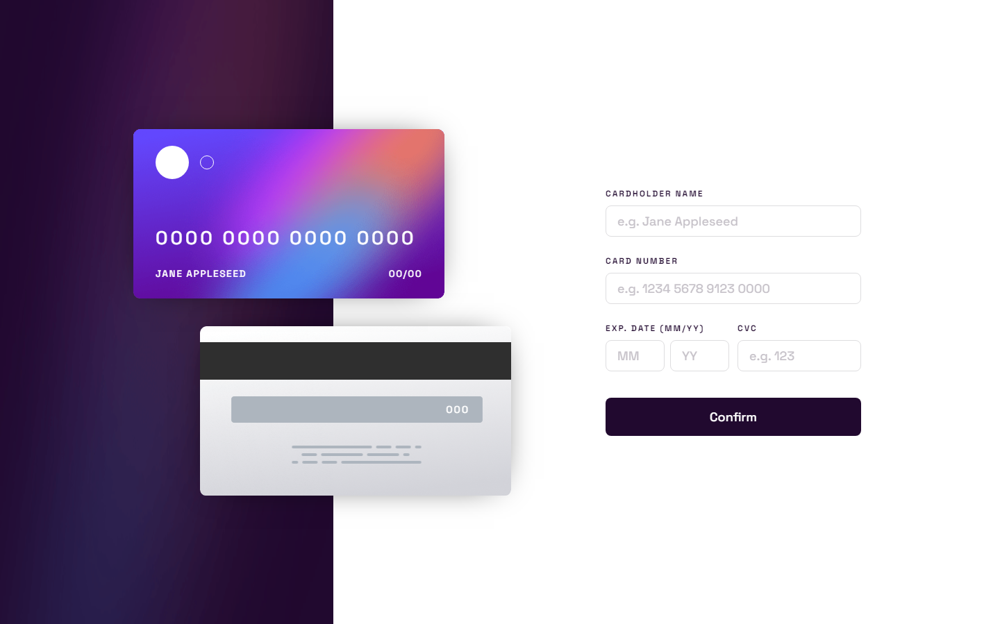

# Frontend Mentor - Interactive card details form solution

This is a solution to the [Interactive card details form challenge on Frontend Mentor](https://www.frontendmentor.io/challenges/interactive-card-details-form-XpS8cKZDWw). Frontend Mentor challenges help you improve your coding skills by building realistic projects. 

## Table of contents

- [Overview](#overview)
  - [The challenge](#the-challenge)
  - [Screenshot](#screenshot)
  - [Links](#links)
- [My process](#my-process)
  - [Built with](#built-with)
  - [What I learned](#what-i-learned)
  - [Continued development](#continued-development)
  - [Useful resources](#useful-resources)
- [Author](#author)

## Overview

### The challenge

Users should be able to:

- Fill in the form and see the card details update in real-time
- Receive error messages when the form is submitted if:
  - Any input field is empty
  - The card number, expiry date, or CVC fields are in the wrong format
- View the optimal layout depending on their device's screen size
- See hover, active, and focus states for interactive elements on the page

### Screenshot



### Links

- HTML Solution: [HTML](https://github.com/JustANipple/interactive-card-details-form/blob/master/index.html)
- SCSS Solution: [SCSS](https://github.com/JustANipple/interactive-card-details-form/blob/master/styles/main.scss)
- JS Solution: [JS](https://github.com/JustANipple/interactive-card-details-form/blob/master/scripts/script.js)
- Site: [see it live](https://justanipple.github.io/interactive-card-details-form/)

## My process

### Built with

- Semantic HTML5 markup
- CSS custom properties
- Flexbox
- CSS Grid
- Mobile-first workflow
- Josh Comeau CSS reset
- SCSS precompiler
- JS form management

### What I learned

I have gone through a guide to have an in-depth idea of how forms validate inputs and i managed to make inputs change appearance and errors based on their content

I'm proud of the pin number that updates each digit typed in the card number input:

```js
inputs[1].addEventListener("input", updatePin);

function updatePin() {
    if(this.value.length === 4 ||
        this.value.length === 9 ||
        this.value.length === 14) {
            this.value += " ";
    }
    const pinParts = frontPin.textContent.split("");
    const pinIn = this.value.split("");
    for(let i = 0; i < pinIn.length; i++) {
        pinParts[i] = pinIn[i];
    }
    frontPin.textContent = pinParts.join("");
    if(this.value === "") {
        frontPin.textContent = "0000 0000 0000 0000";
    }
}
```

### Continued development

Making custom forms is still a challenge and i'll try to improve my knowledge to validate them and make them secure to be sent to the server

### Useful resources

- [Web form guide](https://developer.mozilla.org/en-US/docs/Learn/Forms) - This is a well made guide that covers everything you need to make your own forms

## Author

- Frontend Mentor - [@JustANipple](https://www.frontendmentor.io/profile/JustANipple)
